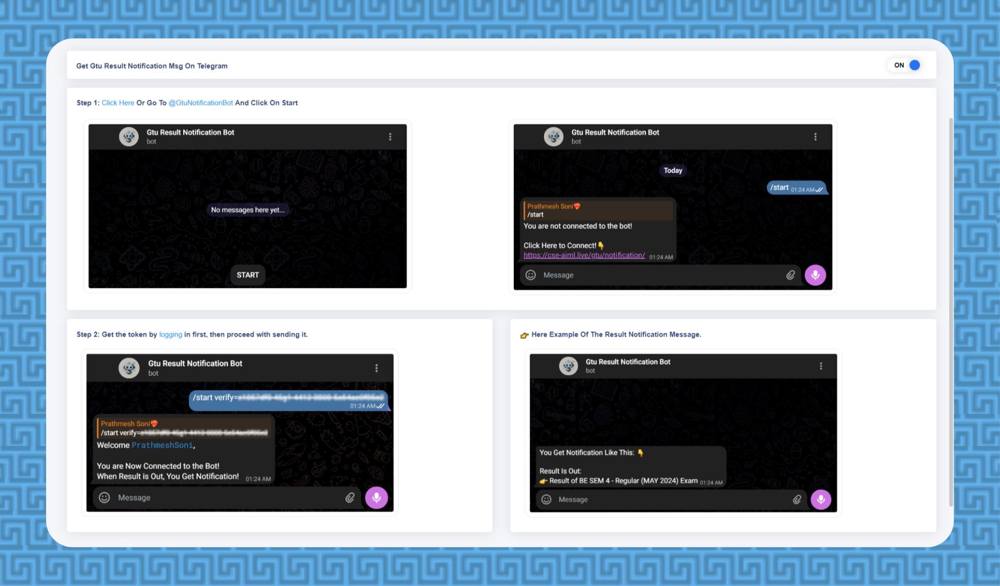

<h1 align="center" class="dotted" id="top">
    <a href="https://cse-aiml.live/github/GtuNotificationBot/logo/?ref=logo-name-github" target="_blank">   
        GtuNotificationBot
    </a>
</h1>

<br>

<p align="center">


<a href="https://github.com/PrathmeshSoni">

</a> 

</p>

📢 GtuNotificationBot is a Telegram bot that notifies users about GTU BE Branch exam results

<br />


# Live Demo 👇:

- **Website:**  <a href="https://cse-aiml.live/github/GtuNotificationBot/page/?ref=live-link-github" target="_blank"> cse-aiml.live</a>

- **Telegram Bot:**  <a href="https://cse-aiml.live/github/GtuNotificationBot/get/?ref=live-link-github" target="_blank"> @GtuNotificationBot</a>

<br />


## About The Project




GtuNotificationBot is a Telegram bot designed to keep users informed about GTU exam results and updates from cse-aiml.live. It allows users to authenticate, receive notifications, and manage their preferences efficiently 📢.


<br />


## Features

- **User Authentication:** Authenticate users via a unique token.
- **Send Messages:** Send messages and notifications to authenticated users.
- **Customizable Notifications:** Allow users to customize their notification preferences.
- **Exam Result Notifications:** Notify users when GTU results are declared.
- **Information Retrieval:** Provide users with the latest information on specific events.

<br />


## Commands

- `/start verify=<auth-token>`: Connect with the bot using an authentication token.
- `/info`: Get detailed information about the bot and its features.
- `/auth`: Authenticate your identity.
- `/current`: See the current exam result.
- `/notify`: Manage notification preferences.
- `/users`: List all connected users.
- `/sendmsg userid=<userid> text=<message>`: Send a message to a specific user.
- `/note`: Access helpful resources related to GTU.
- `/contact`: Reach out for support or queries.
- `/code`: Get the source code of the bot.

<br />


## Getting Started

This is an example of how you may give instructions on setting up your project locally.
To get a local copy up and running follow these simple example steps.

### Prerequisites

Install Python 3.7 or above

* <a href="https://python.org/downloads/" target="_blank">Python</a>

### Installation

1. Clone the repository:
   ```bash
   git clone https://github.com/PrathmeshSoni/GtuNotificationBot.git && cd GtuNotificationBot
   ```

2. Install dependencies:
   ```bash
   pip install -r requirements.txt
   ```

3. Set up your Telegram Bot Token:
   - Obtain your Telegram Bot Token from [@BotFather](https://t.me/BotFather).
   - Replace `'YOUR_BOT_TOKEN'` in `main.py` with your actual Bot Token.


4. Start the bot:
   ```bash
   python main.py
   ```

Visit [`http://t.me/<your-bot-username>`](http://t.me/<your-bot-username>) to interact with your bot.

<br />


## Demo Authentication Token

Use this token for demo purposes:
```
/start verify=Demo-Auth-Token-CSE-AIML-GTU-Bot-@2509
```

<br />


## Usage

- Connect with the bot using `/start verify=<auth-token>` command with your authentication token.
- Use `/info` command to explore available commands and features.
- Manage notifications with `/notify` command to toggle notification preferences.
- Check the latest exam result using `/current` command.

<br />


## Support

For any issues or suggestions, please [open an issue](https://github.com/PrathmeshSoni/GtuNotificationBot/issues) on GitHub.


<br />

## Connect with me at

<p align='center'>
  <a href="https://www.linkedin.com/in/PrathmeshSoni/" target="_blank">
    
  </a>
</p>

<p align='center'>
  📫 How to reach me: <a href='mailto:connect.prathmeshsoni@gmail.com'>connect.prathmeshsoni@gmail.com</a>
</p>


## All Set :)

<p style="float:left;" align="left">
  <a href="#top">Back To Top</a>
</p>

<p style="text-align:right;" align="right">
  <a href="https://github.com/PrathmeshSoni/GtuNotificationBot" target="_blank">Back To Repository</a>
</p>


---
**<a href="https://cse-aiml.live/github/GtuNotificationBot/footer/?ref=footer-github" target="_blank">GtuNotificationBot</a>** - Provided by **<a href="https://prathmeshsoni.works?ref=footer-github" target="_blank">Prathmesh Soni</a>**
